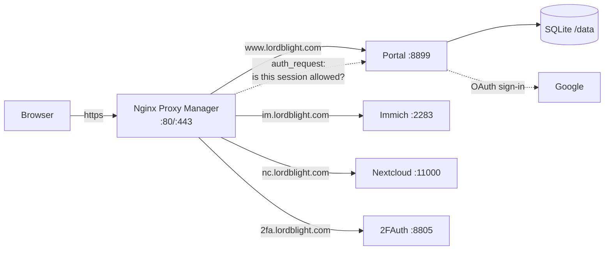

# lordblight.com — Home Server Portal

A self-hosted portal for the Unraid box at `192.168.89.106`, living at **https://www.lordblight.com**.

- **Google sign-in** — users authenticate with their Google account; no passwords to manage.
- **Per-user access** — after signing in, each person sees tiles for only the services you've granted them (Immich, Nextcloud, 2FAuth, …).
- **Admin UI** — you (the admin) grant/revoke services per user, block users, and add **future services** with a form — no code changes.
- **Enforced at the proxy** — Nginx Proxy Manager asks the portal on every request (`auth_request`), so someone without a grant can't reach a service even with a direct link. See [docs/nginx-proxy-manager-forward-auth.md](docs/nginx-proxy-manager-forward-auth.md).

One small container: Node.js + Express + SQLite. No frontend build, no external database.

## How it works



1. A user opens `www.lordblight.com`, signs in with Google. The portal verifies the ID token, creates the user (with **no access**) and sets a session cookie for `.lordblight.com`.
2. You grant them services on **Admin → Users**. Their dashboard shows those tiles.
3. Each service's NPM proxy host asks `GET /api/authz/<slug>` before proxying. `200` = allow, `401` = send to the portal login, `403` = send to the portal "no access" page. Grants and blocks are checked live in the DB, so revoking access kicks in immediately — even for open sessions.

## Repo layout

| Path | What it is |
|---|---|
| `portal/` | The portal app (Express + EJS + SQLite) |
| `portal/.env.example` | Configuration template |
| `docker-compose.yml` | Runs the portal on port **8899** |
| `docs/nginx-proxy-manager-forward-auth.md` | Per-service NPM snippets + troubleshooting |
| `.github/workflows/portal.yml` | CI: tests on PRs, publishes `ghcr.io/rshaker2-ops/homeserver-portal` on `main` |

## Setup

### 1. Create the Google OAuth client

1. Go to [console.cloud.google.com](https://console.cloud.google.com/), create a project (e.g. `lordblight-portal`).
2. **APIs & Services → OAuth consent screen** (labeled "Branding"/"Audience" in the new console):
   - User type **External**, app name, your email.
   - Authorized domain: `lordblight.com`.
   - **Publish the app to Production.** The portal only requests non-sensitive scopes (`openid email profile`), so no Google verification review is needed and users see no warning screen. Don't upload a logo — that *does* trigger a review. (Alternative: keep it in *Testing* mode and add each family member as a test user.)
3. **APIs & Services → Credentials → Create credentials → OAuth client ID**:
   - Type **Web application**.
   - Authorized redirect URIs:
     - `https://www.lordblight.com/auth/google/callback`
     - `http://localhost:8899/auth/google/callback` (optional, for testing on the server itself)
   - Google only allows plain-http redirect URIs for `localhost` — a LAN IP like `http://192.168.89.106:8899` will be rejected, so the real sign-in flow must go through the https domain.
4. Copy the **Client ID** and **Client secret** into your `.env`.

### 2. DNS and the portal's proxy host

- Route 53: `www.lordblight.com` already resolves — nothing to add. (Tip: a wildcard `*.lordblight.com` record pointed the same way means future services need no DNS work.)
- NPM: add a **Proxy Host** for `www.lordblight.com` → `http://192.168.89.106:8899`, with an SSL cert and *Force SSL*. Since you use Route 53, consider requesting a **wildcard certificate via the DNS-01 challenge** (NPM supports Route 53 natively under SSL → Use a DNS Challenge) — one cert covers every current and future subdomain and doesn't depend on port 80.
- Do **not** put a forward-auth snippet on the portal's own host — it handles its own login.
- Heads-up: if your router doesn't support hairpin NAT, LAN clients may not be able to reach the public IP; either enable it, use split-horizon DNS, or point the DNS records at the LAN IP (some routers' DNS-rebind protection blocks private answers and needs an exception for `lordblight.com`).

### 3. Run the portal on Unraid

One-time data dir on the cache pool (SQLite misbehaves on `/mnt/user/...` FUSE shares — use `/mnt/cache/...`):

```bash
mkdir -p /mnt/cache/appdata/portal
chown -R 1000:1000 /mnt/cache/appdata/portal   # container runs as non-root uid 1000
```

Create `/mnt/cache/appdata/portal/.env` from [`portal/.env.example`](portal/.env.example):

```ini
BASE_URL=https://www.lordblight.com
GOOGLE_CLIENT_ID=...apps.googleusercontent.com
GOOGLE_CLIENT_SECRET=...
SESSION_SECRET=<output of: openssl rand -hex 32>
ADMIN_EMAILS=your-google-account@gmail.com
COOKIE_DOMAIN=lordblight.com
```

Then either:

**Option A — prebuilt image** (published by CI after this repo's first merge to `main`; make the GHCR package public once under GitHub → Packages → `homeserver-portal` → Package settings, or `docker login ghcr.io` on the server):

```bash
docker run -d \
  --name homeserver-portal \
  --restart unless-stopped \
  -p 8899:8899 \
  -v /mnt/cache/appdata/portal:/data \
  --env-file /mnt/cache/appdata/portal/.env \
  ghcr.io/rshaker2-ops/homeserver-portal:latest
```

**Option B — build from this repo** (e.g. with the Compose Manager plugin):

```bash
git clone https://github.com/rshaker2-ops/homeserver.git
cd homeserver
cp portal/.env.example portal/.env   # then edit it
# switch the volume in docker-compose.yml to /mnt/cache/appdata/portal as noted there
docker compose up -d --build
```

Check it: `curl http://192.168.89.106:8899/healthz` → `{"ok":true}`, then open `https://www.lordblight.com`.

### 4. First sign-in and granting access

1. Sign in with the Google account listed in `ADMIN_EMAILS` — you'll land on the dashboard with all three seeded tiles (admins see everything).
2. Have a family member sign in once; they'll see *"No services yet"*.
3. Open **Users** (top nav) → tick the services they may use → **Save**. Their next page load shows the tiles, and the proxy starts letting them through.
4. Blocking a user (or *Sign out everywhere*) takes effect immediately. New sign-ins are **default-deny**: anyone with a Google account can authenticate, but they see and reach nothing until you grant it. To stop unknown accounts from even signing in, set `ALLOWED_EMAILS` / `ALLOWED_EMAIL_DOMAINS`.

### 5. Enforce the grants at the proxy

Follow [docs/nginx-proxy-manager-forward-auth.md](docs/nginx-proxy-manager-forward-auth.md) to paste a snippet into the **Advanced** tab of the `im.` / `2fa.` (and optionally `nc.`) proxy hosts. Summary of what's in there:

| Service | Recommendation |
|---|---|
| 2FAuth | Full gate |
| Immich | Gate the web UI; bypass `/api` (mobile app) and `/share` (public links) |
| Nextcloud | Launchpad-only recommended (sync clients); full-gate variant provided |
| NPM admin | Worked example for adding a *future service* — gate it once the portal is proven |

### Adding a future service (example: the NPM admin UI)

1. **Admin → Services → Add service**: name `Proxy Manager`, slug `npm`, URL `https://npm.lordblight.com`, icon `🛠️`.
2. Route 53 record (covered already if you use a wildcard) + NPM proxy host `npm.lordblight.com` → `http://192.168.89.106:81`.
3. Grant it to yourself/whoever on **Users** (admins already see it).
4. Optionally paste the forward-auth snippet with slug `npm` into that proxy host's Advanced tab.

That's the whole pattern for anything you host later — Jellyfin, Uptime Kuma, Home Assistant, etc.

## Configuration reference

| Variable | Required | Meaning |
|---|---|---|
| `BASE_URL` | ✅ | Public portal URL (`https://www.lordblight.com`) |
| `GOOGLE_CLIENT_ID` / `GOOGLE_CLIENT_SECRET` | ✅ | OAuth client from step 1 |
| `SESSION_SECRET` | ✅ | ≥32 chars, `openssl rand -hex 32` |
| `ADMIN_EMAILS` | ✅ (practically) | Comma-separated admin Google emails; applied on every sign-in |
| `COOKIE_DOMAIN` | for forward-auth | Parent domain (`lordblight.com`) so subdomains see the session |
| `ALLOWED_EMAILS` / `ALLOWED_EMAIL_DOMAINS` | – | If set, only these may sign in at all (admins always may) |
| `PORTAL_NAME` | – | Branding (default `lordblight.com`) |
| `PORT` / `DATA_DIR` / `SESSION_MAX_AGE_DAYS` | – | Defaults: `8899` / `/data` / `7` |

## Operations

- **Data**: everything lives in `/data/portal.db` (users, grants, services, sessions). Back up that folder; it's tiny.
- **Update**: `docker pull ghcr.io/rshaker2-ops/homeserver-portal:latest && docker restart homeserver-portal` (or rebuild via compose). Schema migrations run automatically on start.
- **Logs**: `docker logs homeserver-portal`.

## Local development

```bash
cd portal
npm install
cp .env.example .env   # BASE_URL=http://localhost:8899 works with the localhost redirect URI
npm run dev            # auto-reload
npm test               # 24 tests, no Google account needed
```

## Security model (and honest limits)

- Default-deny: a fresh Google sign-in has zero access until granted; unknown services and disabled services also deny.
- Authorization is checked **live** on every request the proxy forwards — revocations and blocks are instant, and blocking also destroys the user's sessions.
- Sessions: HttpOnly, Secure, SameSite=Lax cookies signed with `SESSION_SECRET`; OAuth uses `state` + PKCE and requires a verified email; login rotates the session ID; forms are CSRF-protected; `rd` redirects only allow `*.lordblight.com`.
- **Limits to know about:** enforcement happens at NPM's vhosts, so LAN clients can still hit `192.168.89.106:<port>` directly — that's your escape hatch if the portal is ever down, and it's fine as long as only ports 80/443 are forwarded from the internet. This portal is perimeter auth + launchpad, not SSO *into* the apps: people still use each app's own account. (Future nicety with zero portal changes: enable the apps' native OIDC login against Google so the same account works inside Immich/Nextcloud. If needs ever outgrow this — groups, MFA policies, real SSO — [Authentik](https://goauthentik.io/) is the graduation path.)
