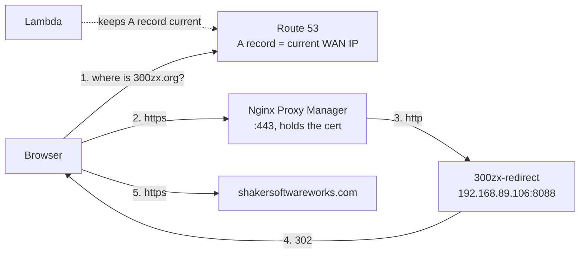

# 300zx.org → shakersoftwareworks.com

`300zx.org` is a second domain on the same Unraid box as everything else in this
repo. It serves no content of its own — every request is redirected to
`shakersoftwareworks.com`.



Three pieces in three places, and they are independent of each other:

| Piece | Lives in | Job |
|---|---|---|
| `A 300zx.org` | Route 53 | answers "what IP?" — nothing else |
| `443 -> 192.168.89.106` | the router | gets the connection to the box |
| the TLS certificate | **NPM** | proves identity, then hands off to the redirector |

A certificate is never attached to DNS. Route 53 has no field for one; by the
time TLS happens its work is finished. ACM certificates cannot be used here at
all — their private key is not exportable, so they only bind to CloudFront /
ALB / API Gateway, never to your own nginx.

## 1. DNS

In the **300zx.org** hosted zone:

| Name | Type | Value | TTL |
|---|---|---|---|
| `300zx.org` | A | current WAN IP | 60 |
| `www.300zx.org` | CNAME | `300zx.org` | 60 |

An alias record is not an option at the apex — aliases target AWS resources, not
raw IPs, so a plain A record is correct.

The dynamic-IP Lambda needs the **300zx.org hosted zone ID** added as a second
`ChangeResourceRecordSets` call, and its execution role needs
`route53:ChangeResourceRecordSets` on that zone's ARN or the call returns 403.
Keep the TTL at 60: anything longer and a WAN IP change leaves the domain dark
for that long.

## 2. Router

Forward **80 and 443** to `192.168.89.106`. Port 8088 must **not** be forwarded —
it is reachable from the LAN only, and NPM is what the internet talks to.

## 3. Certificate

Issued by Let's Encrypt, held by NPM, renewed automatically.

Create an IAM user (programmatic access only, no console login) with this
policy, swapping in the zone ID:

```json
{
  "Version": "2012-10-17",
  "Statement": [
    { "Effect": "Allow",
      "Action": ["route53:ListHostedZones", "route53:GetChange"],
      "Resource": "*" },
    { "Effect": "Allow",
      "Action": "route53:ChangeResourceRecordSets",
      "Resource": "arn:aws:route53:::hostedzone/ZXXXXXXXXXXXXX" }
  ]
}
```

Scope that ARN to the 300zx.org zone only. A leaked key then reaches one zone's
DNS records and nothing else. This is separate from the Lambda, which runs
inside AWS on a role and has no access keys — don't reuse one for the other.

**IAM → Users → the new user → Security credentials → Create access key**, use
case *Application running outside AWS*. The secret is shown exactly once.

Then **NPM → SSL Certificates → Add Let's Encrypt**, domains `300zx.org` and
`*.300zx.org`, tick **Use a DNS Challenge**, provider **Route 53**, credentials:

```
aws_access_key_id = AKIA...
aws_secret_access_key = ...
```

DNS-01 is the right challenge here specifically *because* the IP is dynamic:
it never looks at the A record, so an unattended renewal can't fail just because
the Lambda hadn't caught up. HTTP-01 would fail in that window, silently, and
surface as an expired certificate 30 days later.

The challenge writes a temporary `_acme-challenge` TXT record to Route 53 and
deletes it — Route 53 is a scratchpad for proving ownership, not where the
certificate ends up. The certificate lands on the Unraid box and stays there.

NPM lists a new certificate as unused until a host selects it. That is expected,
not a failed issuance: certificates and hosts are separate objects.

## 4. The redirect

Two equivalent options — pick one, not both.

**NPM Redirection Host** (no code): Hosts → Redirection Hosts → Add, domains
`300zx.org` and `www.300zx.org`, forward domain `shakersoftwareworks.com`,
Preserve Path on, HTTP code 302, then the certificate + Force SSL on the SSL tab.

**This repo's container**, if you'd rather the rule live in version control —
[`sites/300zx-redirect.conf`](../sites/300zx-redirect.conf), wired up in
`docker-compose.yml` as `redirect-300zx`. On Unraid without compose:

```bash
docker run -d --name 300zx-redirect --restart unless-stopped \
  -p 8088:80 \
  -v /mnt/user/appdata/300zx-redirect/default.conf:/etc/nginx/conf.d/default.conf:ro \
  nginx:alpine
```

Then an ordinary NPM **proxy host**: `300zx.org` + `www.300zx.org` →
`http://192.168.89.106:8088`, certificate + Force SSL.

**Use 302, not 301, until the redirect is certainly permanent.** Browsers cache a
301 indefinitely; anyone who visits during a premature 301 keeps getting bounced
forever, without a request ever reaching the server again, and there is no way to
recall it.

## 5. Don't gate this one with the portal

The portal's session cookie is scoped to `lordblight.com`, and its post-login
redirect only accepts hosts under that same domain
([`portal/src/util.js`](../portal/src/util.js) — the `cookieDomain` check). A
forward-auth snippet on `300zx.org` would send the user to log in, succeed, and
redirect back to a host the cookie never reaches: an endless loop. Leave
`300zx.org` ungated.

## Verifying

Work outward — each step only makes sense if the previous one passed.

```bash
# the redirector itself, from the Unraid box
curl -sI http://192.168.89.106:8088 | head -2
#   HTTP/1.1 302 Moved Temporarily
#   Location: https://shakersoftwareworks.com/

# DNS matches the current WAN IP
dig +short 300zx.org
curl -s https://checkip.amazonaws.com

# the certificate NPM is actually serving
curl -vI https://300zx.org 2>&1 | grep -iE "subject:|issuer:|expire"

# the whole path, following the redirect
curl -sIL https://300zx.org | grep -E "^HTTP|^[Ll]ocation"
```

| Symptom | Cause |
|---|---|
| Hangs from the LAN, works from cell data | No hairpin NAT on the router — same caveat as the rest of this repo |
| Certificate warning naming the wrong domain | The host isn't using the certificate you think; re-check the SSL tab selection saved |
| 502 from NPM | The redirect container is down, or the upstream is set to a hostname that resolves to the WAN IP instead of `192.168.89.106` |
| Redirect goes to the homepage, losing the path | `$request_uri` dropped from the `return`, or Preserve Path off |
